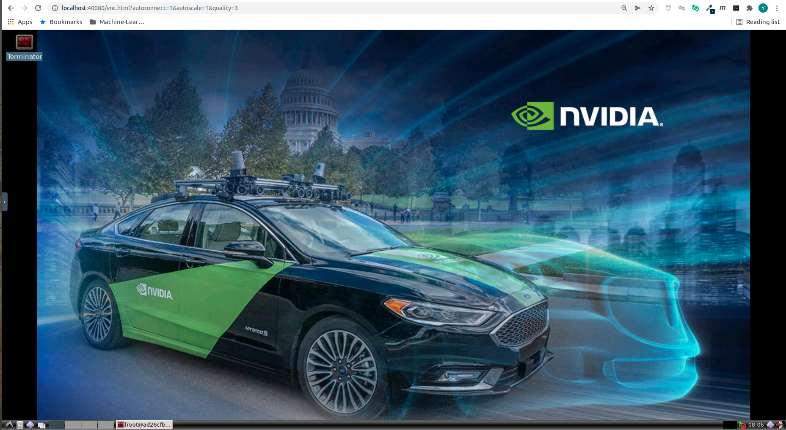
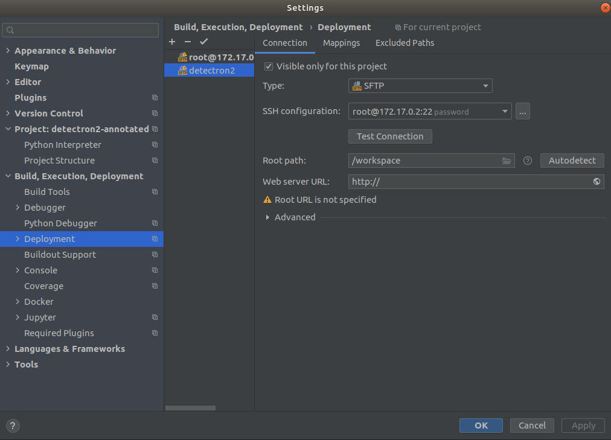
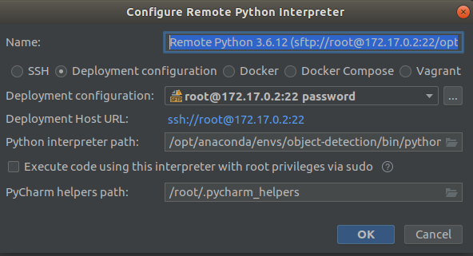
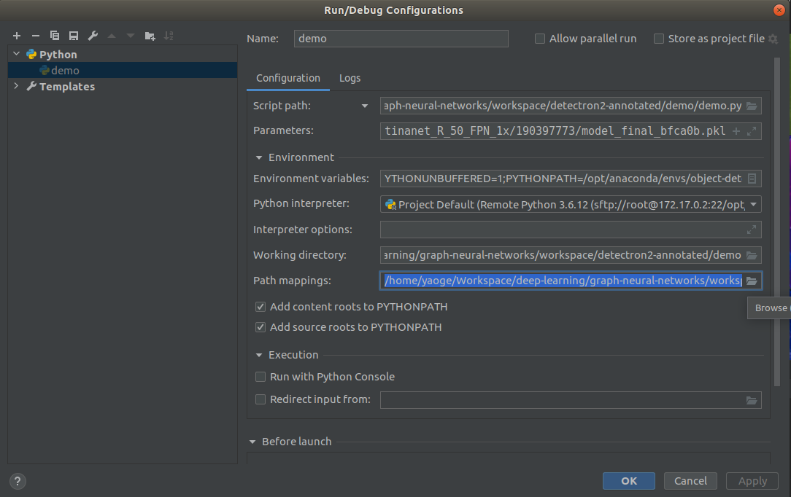
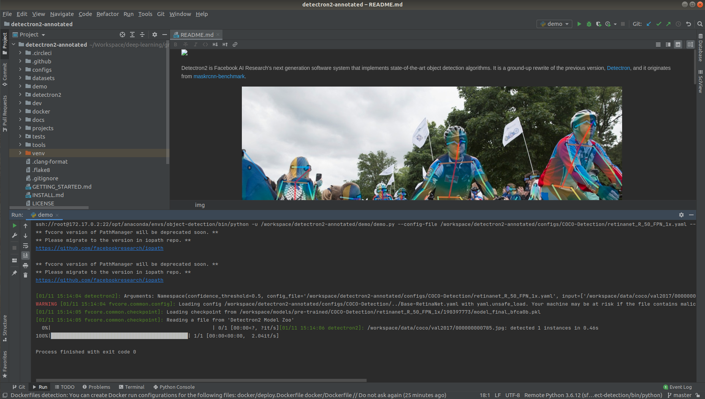
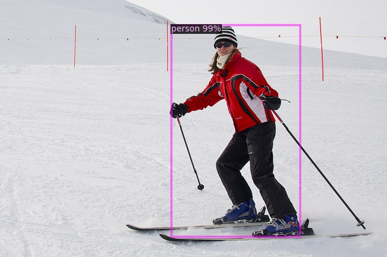

# Development Workspace for Graph Neural Network Learning

Containerized workspace for **Graph Neural Network** prototype development.

---

## Prerequisites

Before using the Docker environment, make sure you have the following dependencies on your local machine:

### Docker

Please follow [the official guide](https://docs.docker.com/engine/install/ubuntu/) to install **Docker**, which provides the virtualization technology behind the isolated workspace, on your local machine.

#### IMPORTANT: Change Current User Group

In order to run Docker commands without sudo:

* Execute the following command to add **current user** to **Docker Group**

    ```bash
    sudo usermod -aG docker $USER
    ```

* Log out, then log in

### Docker-Compose

Please follow [the official guide](https://docs.docker.com/compose/install/) to install **Docker-Compose**, Docker orchestrator on local machine, on your local machine.

### (Optional) NVIDIA Driver & CUDA for GPU Workspace

#### Introduction

For prototyping development the following libraries for **Graph Neural Network development** are used:

* CUDA 11.0, powered by NVIDIA-driver-R450
* PyTorch 1.7.0
* PyTorch Geometric **To-Be-Added**

**Note** For prototyping you just need a CUDA compatible card. For training on large-scale dataset cloud utilities should be used.

#### NVIDIA Driver, R450

**Note** make sure you have installed the exact version of NVIDIA driver on your machine. Otherwise the driver could be imcompatible with GPU container.

* First, use the command below to make sure you have CUDA compatible NVIDIA display card on your local machine. 
    
    ```bash
    sudo lshw -C display
    ```

* Follow [this guide](https://www.cyberciti.biz/faq/ubuntu-linux-install-nvidia-driver-latest-proprietary-driver/), **Install Nvidia driver using GUI method # 1 on Ubuntu Linux** to enable the latest NVIDIA driver on your local machine.

#### NVIDIA Container Toolkit

Use the command below to install **NVIDIA Container Toolkit**, which enables NVIDIA runtime for docker, on your local machine:

```bash
# add repository:
distribution=$(. /etc/os-release;echo $ID$VERSION_ID)

curl -s -L https://nvidia.github.io/nvidia-docker/gpgkey | sudo apt-key add -
curl -s -L https://nvidia.github.io/nvidia-docker/$distribution/nvidia-docker.list | sudo tee /etc/apt/sources.list.d/nvidia-docker.list

# install:
sudo apt-get update && sudo apt-get install -y nvidia-container-toolkit nvidia-docker2

# restart docker:
sudo systemctl restart docker
```

**Note** For **CN** developmers, please also add Docker registry from Alibaba Cloud to accelerate image fetching:

* Open Docker daemon config:
    ```bash
    sudo gedit daemon.json
    ```

* Add **registry-mirrors**
    ```json
    {
        "registry-mirrors": ["https://[YOUR_IMAGE_ACCELERATOR_ID].mirror.aliyuncs.com/"],
        "runtimes": {
            "nvidia": {
                "path": "nvidia-container-runtime",
                "runtimeArgs": []
            }
        }
    }

* Restart docker
    ```bash
    # restart docker:
    sudo systemctl restart docker
    ```

#### Final Verification

Use the following command to ensure you have all the dependencies ready:

```bash
# run nvidia-smi inside base gpu docker:
docker run --rm --gpus all nvidia/cuda:11.0-cudnn8-devel-ubuntu18.04 nvidia-smi
# expected output:
Fri Jan  8 10:32:06 2021       
+-----------------------------------------------------------------------------+
| NVIDIA-SMI 450.80.02    Driver Version: 450.80.02    CUDA Version: 11.0     |
|-------------------------------+----------------------+----------------------+
| GPU  Name        Persistence-M| Bus-Id        Disp.A | Volatile Uncorr. ECC |
| Fan  Temp  Perf  Pwr:Usage/Cap|         Memory-Usage | GPU-Util  Compute M. |
|                               |                      |               MIG M. |
|===============================+======================+======================|
|   0  Quadro P620         Off  | 00000000:01:00.0  On |                  N/A |
| 34%   34C    P0    N/A /  N/A |    687MiB /  1997MiB |      0%      Default |
|                               |                      |                  N/A |
+-------------------------------+----------------------+----------------------+
                                                                               
+-----------------------------------------------------------------------------+
| Processes:                                                                  |
|  GPU   GI   CI        PID   Type   Process name                  GPU Memory |
|        ID   ID                                                   Usage      |
|=============================================================================|
+-----------------------------------------------------------------------------+
```

---

## Up & Running

Now you are ready to explore the web workspace for X-VectorNet prototype development.

### Launch Environment

Execute the commands below at the root of repo to launch development environments.

**Note** bash script is still used due to Docker-Compose's limited support of NVIDIA-container-toolkit.

```bash
# launch CPU workspace:
docker-compose up workspace-bionic-cpu-vnc
# launch GPU workspace:
./workspace-gpu-up.sh
```

You can identify the running workspace by the following commands:
```bash
# list the running docker instances:
docker ps -a
```

### Access Web Workspace

Now go to **http://localhost:40080/** to access the web workspace. This is a virtual desktop powered by [noVNC](https://github.com/novnc/noVNC).



---

## PyCharm Remote Debug

### Remote Server Config

First, add a remote server configuration as follows:



### Remote Python Interpreter

Then, add a remote Python interpreter as follows:



### Run/Debug Configurations

Finally:

* Add **PYTHONPATH** to Run/Debug Configuration

    ```bash
    # execute this inside Docker web workspace, with target conda env activated:
    (object-detection) root@4fc082c3a132:~# python
    Python 3.6.12 |Anaconda, Inc.| (default, Sep  8 2020, 23:10:56) 
    [GCC 7.3.0] on linux
    Type "help", "copyright", "credits" or "license" for more information.
    >>> import detectron2
    >>> detectron2.__version__
    '0.3'
    >>> detectron2.__file__
    '/opt/anaconda/envs/object-detection/lib/python3.6/site-packages/detectron2/__init__.py'
    # set PYTHONPATH in Run/Debug Configuration using the value found above:
    export PYTHONPATH=/opt/anaconda/envs/object-detection/lib/python3.6/site-packages
    ```

* Map local path to remote path according to volume mount config:

    

### Verification

Verify that everything is there by run a demo detection:



Input                      |Output
:-------------------------:|:-------------------------:
  |  

---
