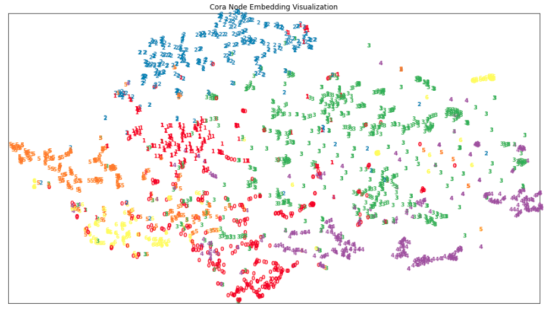

# Deep Learning on Graphs, 01 Graph Embedding

---

## Environment Setup

The virtual environment used is defined by [this Conda environment file](docker/environment/graph/graph.yaml)

---

## Node2Vec Second-Order Walk

### Python Native Implementation

```Python
def _n2v_random_walk(
    indptr,
    indices,
    walk_length,
    walks_per_node,
    p,
    q
):
    # num. of nodes:
    V = len(indptr) - 1
    
    # init output:
    final_walks = []
    for _ in range(walks_per_node):
        for start in range(V):
            # init current walk:
            (prev, curr) = (start, start)
            walk = [curr]
            
            if walk_length > 1:
                # implement node2vector random walk:
                for _ in range(walk_length - 1):
                    # get previous context:
                    prev_context = set(
                        indices[indptr[prev]:indptr[prev+1]]
                    )
                    # get current context:
                    curr_context = set(
                        indices[indptr[curr]:indptr[curr+1]]
                    )
                                        
                    # set sampling weights:
                    context = dict()

                    # option 1 -- current neighbor is parent:
                    if prev in curr_context:
                        context[prev] = (1.0 / p)
                        
                    # option 2 -- distance to parent is 1:
                    for neighbor in curr_context.intersection(prev_context):
                        if (neighbor != prev):
                            context[neighbor] = 1.0

                    # option 3 -- distance to parent is 2:
                    for neighbor in curr_context.difference(prev_context):
                        if (neighbor != prev):
                            context[neighbor] = (1.0 / q)

                    #
                    # sample by weights:
                    #
                    # preparation -- get candidate neighbors:
                    neighbors = np.asarray(list(context.keys()), dtype=np.int32)
                    # preparation -- get sampling probabilities:
                    weights = np.asarray(list(context.values()), dtype=np.float32)
                    probs = weights / np.sum(weights)
                    # sample by probabilities:
                    (prev, curr) = (
                        curr, np.random.choice(neighbors, size=None, p=probs)
                    )
                    
                    # done:
                    walk.append(curr)
                    
            # done:
            final_walks.append(walk)
    
    # done:
    return np.array(final_walks)
```

### Numba Accelerated Implementation

```Python
@numba.jit(nopython=True)
def random_choice(arr, p):
    """ sample node by probability """
    return arr[np.searchsorted(np.cumsum(p), np.random.random(), side="right")]

@numba.jit(nopython=True)
def _n2v_random_walk_numba(
    indptr,
    indices,
    walk_length,
    walks_per_node,
    p,
    q
):
    # num. of nodes:
    V = len(indptr) - 1
    
    for _ in range(walks_per_node):
        for start in range(V):
            # init current walk:
            (prev, curr) = (start, start)
            walk = [curr]
            
            if walk_length > 1:
                # implement node2vector random walk:
                for _ in range(walk_length - 1):
                    # get previous context:
                    prev_context = set(
                        indices[indptr[prev]:indptr[prev+1]]
                    )
                    # get current context:
                    curr_context = set(
                        indices[indptr[curr]:indptr[curr+1]]
                    )
                                        
                    # set sampling weights:
                    context = dict()

                    # option 1 -- current neighbor is parent:
                    if prev in curr_context:
                        context[prev] = (1.0 / p)
                        
                    # option 2 -- distance to parent is 1:
                    for neighbor in curr_context.intersection(prev_context):
                        if (neighbor != prev):
                            context[neighbor] = 1.0

                    # option 3 -- distance to parent is 2:
                    for neighbor in curr_context.difference(prev_context):
                        if (neighbor != prev):
                            context[neighbor] = (1.0 / q)

                    #
                    # sample by weights:
                    #
                    # preparation -- get candidate neighbors:
                    neighbors = np.asarray(list(context.keys()), dtype=np.int32)
                    # preparation -- get sampling probabilities:
                    weights = np.asarray(list(context.values()), dtype=np.float32)
                    probs = weights / np.sum(weights)
                    # sample by probabilities:
                    (prev, curr) = (
                        curr, random_choice(neighbors, p=probs)
                    )
                    
                    # done:
                    walk.append(curr)
                    
            yield walk
```

---

## t-SNE Visualization Sanity Check

### Visualization

