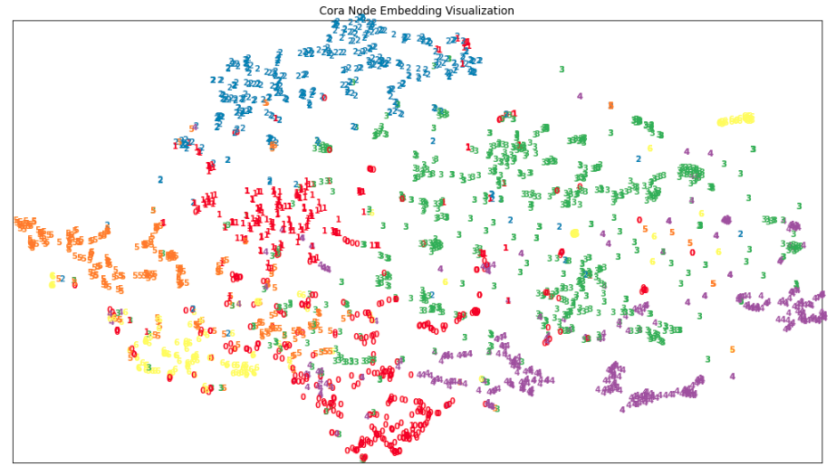

# Deep Learning on Graphs, 01 Graph Embedding

---

## Environment Setup

The virtual environment used is defined by [this Conda environment file](docker/environment/graph/graph.yaml)

---

## Up & Running

First, run the command below inside Docker:

```bash
jupyter-lab --ip=0.0.0.0 --port=6006 --no-browser --allow-root
```

Then the Jupyter notebook will be available at **localhost:46006**

---

## Node2Vec Second-Order Walk

### Python Native Implementation

```Python
def _n2v_random_walk(
    indptr,
    indices,
    walk_length,
    walks_per_node,
    p,
    q
):
    # num. of nodes:
    V = len(indptr) - 1
    
    # init output:
    final_walks = []
    for _ in range(walks_per_node):
        for start in range(V):
            # init current walk:
            (prev, curr) = (start, start)
            walk = [curr]
            
            if walk_length > 1:
                # implement node2vector random walk:
                for _ in range(walk_length - 1):
                    # get previous context:
                    prev_context = set(
                        indices[indptr[prev]:indptr[prev+1]]
                    )
                    # get current context:
                    curr_context = set(
                        indices[indptr[curr]:indptr[curr+1]]
                    )
                                        
                    # set sampling weights:
                    context = dict()

                    # option 1 -- current neighbor is parent:
                    if prev in curr_context:
                        context[prev] = (1.0 / p)
                        
                    # option 2 -- distance to parent is 1:
                    for neighbor in curr_context.intersection(prev_context):
                        if (neighbor != prev):
                            context[neighbor] = 1.0

                    # option 3 -- distance to parent is 2:
                    for neighbor in curr_context.difference(prev_context):
                        if (neighbor != prev):
                            context[neighbor] = (1.0 / q)

                    #
                    # sample by weights:
                    #
                    # preparation -- get candidate neighbors:
                    neighbors = np.asarray(list(context.keys()), dtype=np.int32)
                    # preparation -- get sampling probabilities:
                    weights = np.asarray(list(context.values()), dtype=np.float32)
                    probs = weights / np.sum(weights)
                    # sample by probabilities:
                    (prev, curr) = (
                        curr, np.random.choice(neighbors, size=None, p=probs)
                    )
                    
                    # done:
                    walk.append(curr)
                    
            # done:
            final_walks.append(walk)
    
    # done:
    return np.array(final_walks)
```

### Numba Accelerated Implementation

```Python
@numba.jit(nopython=True)
def random_choice(arr, p):
    """ sample node by probability """
    return arr[np.searchsorted(np.cumsum(p), np.random.random(), side="right")]

@numba.jit(nopython=True)
def _n2v_random_walk_numba(
    indptr,
    indices,
    walk_length,
    walks_per_node,
    p,
    q
):
    # num. of nodes:
    V = len(indptr) - 1
    
    for _ in range(walks_per_node):
        for start in range(V):
            # init current walk:
            (prev, curr) = (start, start)
            walk = [curr]
            
            if walk_length > 1:
                # implement node2vector random walk:
                for _ in range(walk_length - 1):
                    # get previous context:
                    prev_context = set(
                        indices[indptr[prev]:indptr[prev+1]]
                    )
                    # get current context:
                    curr_context = set(
                        indices[indptr[curr]:indptr[curr+1]]
                    )
                                        
                    # set sampling weights:
                    context = dict()

                    # option 1 -- current neighbor is parent:
                    if prev in curr_context:
                        context[prev] = (1.0 / p)
                        
                    # option 2 -- distance to parent is 1:
                    for neighbor in curr_context.intersection(prev_context):
                        if (neighbor != prev):
                            context[neighbor] = 1.0

                    # option 3 -- distance to parent is 2:
                    for neighbor in curr_context.difference(prev_context):
                        if (neighbor != prev):
                            context[neighbor] = (1.0 / q)

                    #
                    # sample by weights:
                    #
                    # preparation -- get candidate neighbors:
                    neighbors = np.asarray(list(context.keys()), dtype=np.int32)
                    # preparation -- get sampling probabilities:
                    weights = np.asarray(list(context.values()), dtype=np.float32)
                    probs = weights / np.sum(weights)
                    # sample by probabilities:
                    (prev, curr) = (
                        curr, random_choice(neighbors, p=probs)
                    )
                    
                    # done:
                    walk.append(curr)
                    
            yield walk
```

---

## t-SNE Visualization Sanity Check

To verify the correctness of Node2Vec implementation, before feeding the embeddings into the classifier first use t-SNE to visualize them. The result is shown below. From the illustration we know that **the trained node embedding is good enough for baseline classification task**.

### Visualization



### Implementation

```Python
# set up session:
from sklearn.manifold import TSNE
import matplotlib.pyplot as plt

def plot_embedding(
    embeddings, labels, 
    title
):
    """plot node embedding with tSNE"""
    # fit tSNE:
    tsne = TSNE(n_components=2, init='pca', random_state=42)
    data = tsne.fit_transform(
        normalize(embeddings)
    )
    
    # preprocess for visualization:
    x_min, x_max = np.min(data, 0), np.max(data, 0)
    data = (data - x_min) / (x_max - x_min)
     
    # visualize:
    (V, _) = data.shape
    
    fig = plt.figure(figsize=(16, 9), dpi=80)
    ax = plt.subplot(111)
    for node_id in range(V):
        plt.text(
            data[node_id, 0], data[node_id, 1], str(labels[node_id]),
            color=plt.cm.Set1(labels[node_id] / 10.),
            fontdict={'weight': 'bold', 'size': 9}
        )
        
    plt.xticks([])
    plt.yticks([])
    plt.title(title)
    
    return fig

# generate visualization:
plt.show(
    plot_embedding(
        embedding, np.asarray(data.y), 
        'Cora Node Embedding Visualization'
    )
)
```

---

## Baseline Classification: With MLP

The multi-class classification report is as follows:

```bash
              precision    recall  f1-score   support

           0       0.58      0.55      0.56       130
           1       0.67      0.81      0.73        91
           2       0.88      0.85      0.86       144
           3       0.77      0.62      0.69       319
           4       0.59      0.56      0.58       149
           5       0.60      0.78      0.68       103
           6       0.46      0.67      0.54        64

    accuracy                           0.67      1000
   macro avg       0.65      0.69      0.66      1000
weighted avg       0.69      0.67      0.67      1000
```

### Implementation

```Python
def evaluate_node_classification(
    embedding_matrix, labels, 
    train_mask, test_mask, 
    normalize_embedding=True, max_iter=1000
):      
    """ use single-layer MLP for node label prediction using node2vec embeddings
    """
    # normalize:
    X = embedding_matrix
    if normalize_embedding:
        X = normalize(embedding_matrix)
    
    # split train-test sets:
    X_train, y_train = X[train_mask, :], labels[train_mask]
    X_test, y_test = X[test_mask, :], labels[test_mask]
    
    # build classifier:
    clf = MLPClassifier(
        random_state=42,
        hidden_layer_sizes=[32],
        max_iter=max_iter
    ).fit(X_train, y_train)
    
    # make prediction:
    preds = clf.predict(X_test)
    
    # get classification report:
    print(
        classification_report(
            y_true=y_test, y_pred=preds
        )
    )
    # get accuracy score:
    test_acc = accuracy_score(y_true=y_test, y_pred=preds)
    
    return preds, test_acc
```