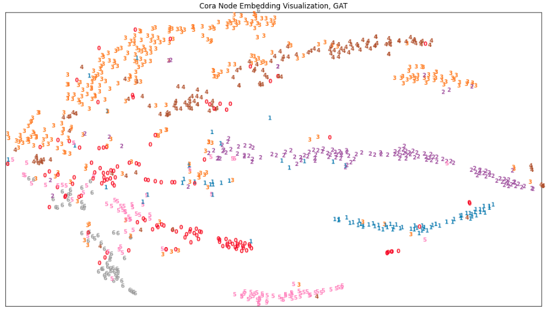

# Deep Learning on Graphs, 02 Graph Neural Networks

---

## Environment Setup

The virtual environment used is defined by [this Conda environment file](docker/environment/graph/graph.yaml)

---

## Up & Running

First, run the command below inside Docker:

```bash
jupyter-lab --ip=0.0.0.0 --port=6006 --no-browser --allow-root
```

Then the Jupyter notebook will be available at **localhost:46006**

---

## GAT Implementation

### Implementation

#### Forward Propagation

```Python
def forward(self, graph, feat):
    # 0. get current hidden layer
    feat_in = self.fc(feat).view(
        *feat.shape[:-1], 
        self.num_heads, self.out_feats
    )
    feat_in = self.feat_drop(feat_in)
    
    #
    # DGL message passing begin
    #
    graph.srcdata['h_in'] = feat_in
    
    # 1. 把转换后的特征赋到点上。通过自定义lambda方法把源和邻居节点的特征concat起来，存到边上
    u_cat_v = lambda edges: {
        'h_cat': torch.cat(
            tensors=(edges.dst['h_in'], edges.src['h_in']),
            dim=-1
        )
    }
    graph.apply_edges(u_cat_v)
    
    # 2. 取出边上的特征，进行多头attention转换，并做LeakyRelu计算
    a = (self.attn * graph.edata.pop('h_cat')).sum(dim=-1).unsqueeze(-1)
    a = self.leaky_relu(a)
        
    # 3. 使用DGL的edg_softmax函数完成按边的softmax计算
    a = edge_softmax(graph, a)
    
    # 4. 对softmax值做dropout后，赋给边
    graph.edata['a'] = self.attn_drop(a)
    
    # 5. 用softmax值和feat_head的特征，通过消息函数和聚合函数完成GAT的核心计算
    graph.update_all(
        fn.u_mul_e('h_in', 'a', 'h_weighed'),
        fn.sum('h_weighed', 'h_out')
    )
    
    #
    # DGL message passing end
    #
    feat_out = graph.dstdata['h_out']

    # 使用bias项
    if self.bias is not None:
        feat_out = feat_out + self.bias.view(*((1,) * len(feat.shape[:-1])), self.num_heads, self.out_feats)
    
    # 使用activation函数
    if self.activation:
        feat_out = self.activation(feat_out)

    return feat_out
```

#### Training

```Python
def train(model, g, lr=0.01, weight_decay=5e-4, epochs=200):
    """ training
    """
    mask = g.ndata['train_mask']
    X = g.ndata['feat']
    Y_true = g.ndata['label']
    
    optimizer = optim.Adam(model.parameters(), lr=lr, weight_decay=weight_decay)
    for i in range(epochs):
        model.train()
        
        optimizer.zero_grad()
        Y_prob = model(g, X)

        loss = F.nll_loss(Y_prob[mask], Y_true[mask])
        loss.backward()
        optimizer.step()

        if i % 20 == 0:
            print('\tEpoch {}, training loss: {}'.format(i, loss.item()))
```

#### Evaluation

```Python
@torch.no_grad()
def test(model, g):
    """ evaluation on test set.
    """
    model.eval()
    
    mask = g.ndata['test_mask']
    
    X = g.ndata['feat']
    Y_true = g.ndata['label']
    
    # make predictions:
    Y_prob = model(g, X)
    Y_pred = Y_prob.argmax(1)
    
    # get loss:
    loss = F.nll_loss(Y_prob[mask], Y_true[mask]).item()
    # get accuracy:
    acc = Y_pred[mask].eq(Y_true[mask]).cpu().numpy().mean().item()
    
    print(
        "Evaluation results:",
        "\tloss= {:.4f}".format(loss),
        "\taccuracy= {:.4f}".format(acc)
    )
    
    return Y_pred[mask], Y_prob[mask], Y_true[mask], acc
```

#### Result

```bash
# training log:
Training on Cora...
	Epoch 0, training loss: 4.023165225982666
	Epoch 20, training loss: 1.8430893421173096
	Epoch 40, training loss: 1.4617226123809814
	Epoch 60, training loss: 1.051328182220459
	Epoch 80, training loss: 0.9337846040725708
	Epoch 100, training loss: 0.7319686412811279
	Epoch 120, training loss: 0.5690590143203735
	Epoch 140, training loss: 0.7382293939590454
	Epoch 160, training loss: 0.6500533223152161
	Epoch 180, training loss: 0.6467163562774658
Done!
# evaluation log:
Evaluation results: 	loss= 0.7064 	accuracy= 0.7990
```



