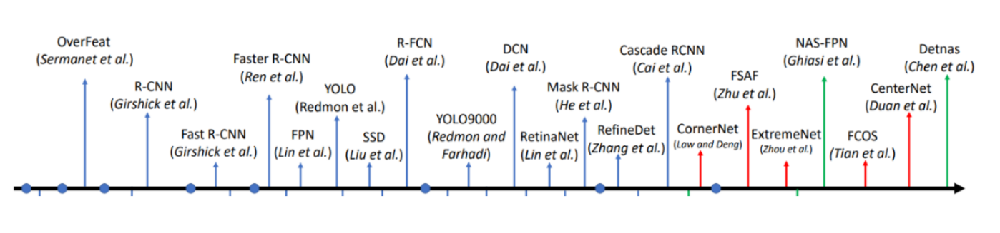
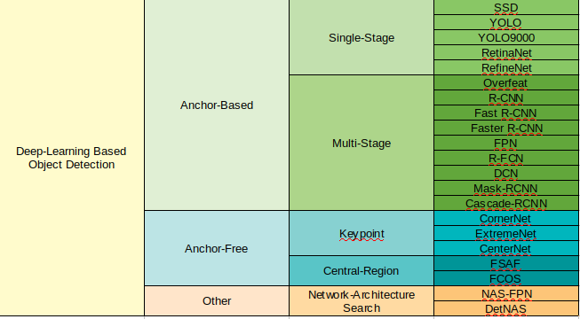
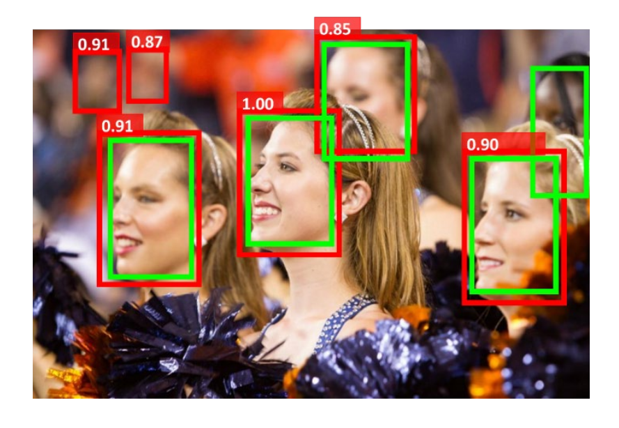
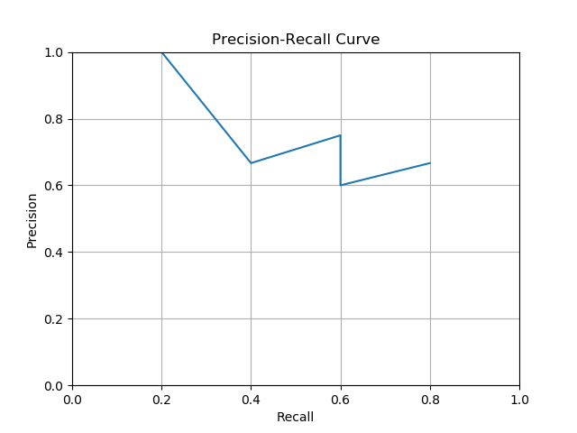

# Deep-Learning Based Object Detection -- 基于深度学习的物体检测

This is the solution of Assignment 01 of Deep-Learning Based Object Detection from [深蓝学院](https://www.shenlanxueyuan.com/course/250).

深蓝学院基于深度学习的物体检测第1节Introduction答案. 版权归深蓝学院所有. 请勿抄袭.

---

## Solutions

---

### 1. Classify the Algorithms Below
### 1. 对下面的物体检测算法进行归纳



The classification of algorithms is summarized in the following table



---

### 2. Calculate Recall, Precision, Miss-Rate and Precision-Recall Curve for the following detection
### 2. 计算下图的召回率、精度、漏检率, 并画出召回率-精度曲线



Define `confidence threshold` as `>= 0.90`, the required KPIs are as follows:

|    KPI    | Value |
|:---------:|:-----:|
| Precision | 66.7% |
|   Recall  | 80.0% |
| Miss Rate | 20.0% |

And the `precision-recall curve`:

```python
plt.plot(
    # recall:
    [1.0/5, 2.0/5, 3.0/5, 3.0/5, 4.0/5], 
    # precision:
    [1.0, 2.0/3, 3.0/4, 3.0/5, 4.0/6]
)
# plot attributes:
plt.xlabel('Recall'); plt.ylabel('Precision'); 
plt.xlim(0.0, 1.0); plt.ylim(0.0, 1.0); 
plt.title('Precision-Recall Curve'); 
plt.grid(True)
# show:
plt.show()
```




