# Deep-Learning Based Object Detection -- 基于深度学习的物体检测

This is the solution of Assignment 02, Environment Setup, of Deep-Learning Based Object Detection from [深蓝学院](https://www.shenlanxueyuan.com/course/250).

深蓝学院基于深度学习的物体检测第2节Environment Setup答案. 版权归深蓝学院所有. 请勿抄袭.

---

## Solutions

---

### 1. Run *demo.py* of detectron2 on the 5 images from https://github.com/rbgirshick/py-faster-rcnn/tree/master/data/demo using both *Faster R-CNN_R50-FPN_1x* and *RetinaNet_R50_1x* and compare their detection results
### 1. 利用detectron2提供的Faster R-CNN_R50-FPN_1x模型和RetinaNet_R50_1x模型测试https://github.com/rbgirshick/py-faster-rcnn/tree/master/data/demo里面的5张图片, 对比两者的检测结果

The solution script is available [here](scripts/run_assignment_01.sh)

```bash
#! /bin/bash

# use faster r-cnn
echo "[Object Detection on Batch Images]: Using Faster R-CNN..."
python /workspace/detectron2/demo/demo.py \
    --config-file /workspace/detectron2/configs/COCO-Detection/faster_rcnn_R_50_FPN_1x.yaml \
    --input /workspace/assignments/02-detectron2/data/*.jpg \
    --output /workspace/assignments/02-detectron2/output/assignment/01/faster_rcnn \
    --opts MODEL.WEIGHTS /workspace/models/pre-trained/COCO-Detection/faster_rcnn_R_50_FPN_1x/137257794/model_final_b275ba.pkl
echo "[Object Detection on Batch Images]: Faster R-CNN DONE."

# use retinanet
echo "[Object Detection on Batch Images]: Using RetinaNet..."
python /workspace/detectron2/demo/demo.py \
    --config-file /workspace/detectron2/configs/COCO-Detection/retinanet_R_50_FPN_1x.yaml \
    --input /workspace/assignments/02-detectron2/data/*.jpg \
    --output /workspace/assignments/02-detectron2/output/assignment/01/retinanet \
    --opts MODEL.WEIGHTS /workspace/models/pre-trained/COCO-Detection/retinanet_R_50_FPN_1x/190397773/model_final_bfca0b.pkl
echo "[Object Detection on Batch Images]: RetinaNet DONE."
```

The object detection results from `Faster R-CNN R50 FPN 1x` and `RetinaNet R50 1x` are shown below

Input Image                 |Faster R-CNN               |RetinaNet
:--------------------------:|:-------------------------:|:-------------------------:
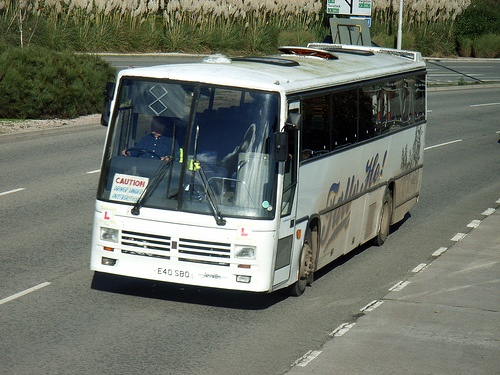||
|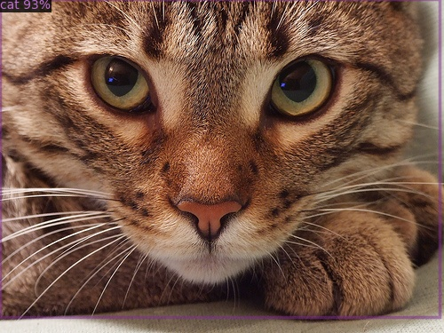|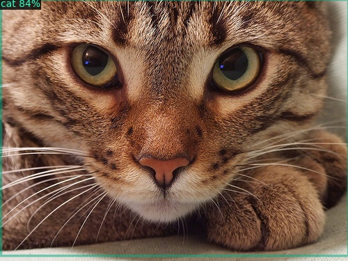
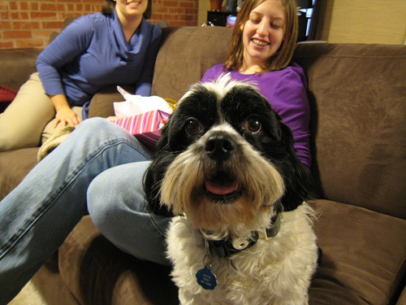|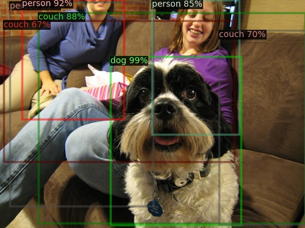|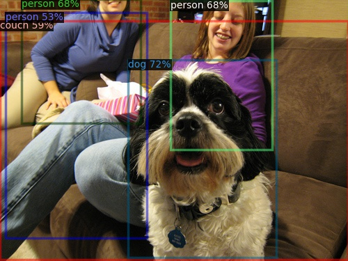
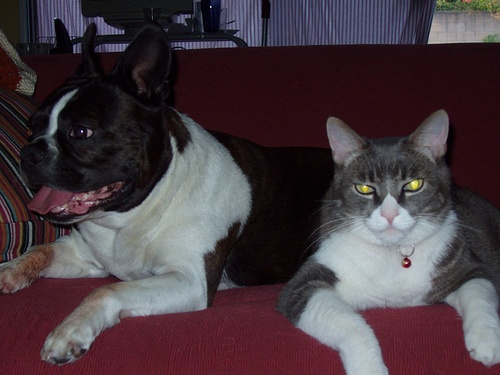|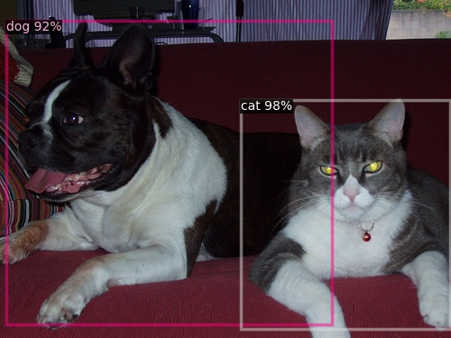|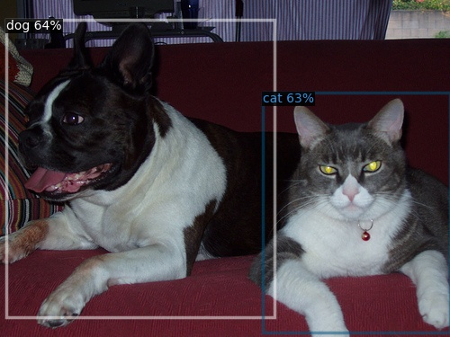
|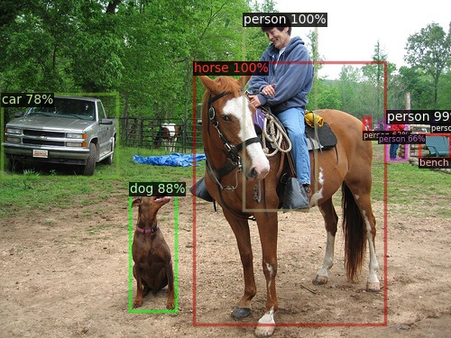|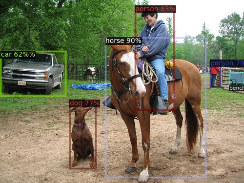

To sum up:

* The detection results from the two models are comparable. Each foreground object is correctly located by the output bounding box.
* However, the output from `Faster R-CNN R50 FPN 1x` has higher confidence than that from `RetinaNet R50 FPN 1x`.

---

### 2. Run both *Faster R-CNN_R50-FPN_1x* and *RetinaNet_R50_1x* on MS COCO 2017 validation set and reproduce the metrics on official website
### 2. 利用detectron2提供的Faster R-CNN_R50-FPN_1x模型和RetinaNet_R50_1x模型在MS COCO验证集上进行评测,得到官方给出的精度

The solution script is avaiable at [here](scripts/run_assignment_02.sh)

```bash
#! /bin/bash

export DETECTRON2_DATASETS=/workspace/data

# use faster r-cnn
echo "[MS COCO 2017 Validation]: Using Faster R-CNN..."
python /workspace/detectron2/tools/train_net.py \
    --config-file /workspace/detectron2/configs/COCO-Detection/faster_rcnn_R_50_FPN_1x.yaml \
    --eval-only MODEL.WEIGHTS /workspace/models/pre-trained/COCO-Detection/faster_rcnn_R_50_FPN_1x/137257794/model_final_b275ba.pkl
echo "[MS COCO 2017 Validation]: Faster R-CNN DONE."

# use retinanet
echo "[MS COCO 2017 Validation]: Using RetinaNet..."
python /workspace/detectron2/tools/train_net.py \
    --config-file /workspace/detectron2/configs/COCO-Detection/retinanet_R_50_FPN_1x.yaml \
    --eval-only MODEL.WEIGHTS /workspace/models/pre-trained/COCO-Detection/retinanet_R_50_FPN_1x/190397773/model_final_bfca0b.pkl
echo "[MS COCO 2017 Validation]: RetinaNet DONE."
```

The full output log can be found here:

* `Faster R-CNN` [here](output/assignment/02/retinanet/log.txt)
* `RetinaNet` [here](output/assignment/02/retinanet/log.txt)

And the key metrics are summarized below:

|          Model          | Avg. Inference Speed |   AP   |  AP50  |  AP75  |   APs  |   APm  |   APl  |
|:-----------------------:|:--------------------:|:------:|:------:|:------:|:------:|:------:|:------:|
| Faster R-CNN R50 FPN 1x |    0.0818 s / img    | 37.932 | 58.835 | 41.048 | 22.440 | 41.145 | 49.098 |
|   RetinaNet R50 FPN 1x  |    0.1260 s / img    | 37.424 | 56.715 | 40.272 | 23.132 | 41.593 | 48.300 |