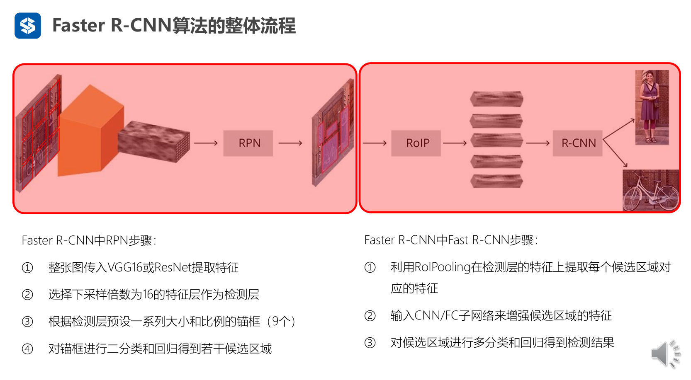

# Multi-Stage Object Detection Learning Note

This is the code analysis note for [Faster R-CNN](https://arxiv.org/pdf/1506.01497)

---

## Overview

The overall workflow of **Faster R-CNN** is shown in the picture below:

It consists of **3** sub networks: